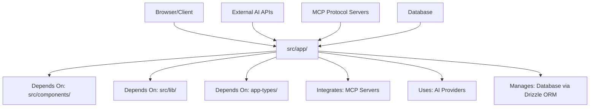

# CLAUDE.md for src/app/

## Folder Identity
### Classification
- **Primary Type**: Source Code - Next.js App Router Application
- **Secondary Types**: Full-Stack Web Application, TypeScript-based, Production-Ready
- **Domain**: AI Chatbot Platform with MCP Integration, Agent Management, and Workflow Automation
- **Criticality**: Essential - Core application structure

### Purpose Statement
This folder contains the complete Next.js 15 App Router application structure for "better-chatbot", an advanced AI chatbot platform built entirely on **Vercel AI SDK** as the foundational AI framework. It provides unified access to multiple LLM providers through Vercel AI SDK abstractions, integrates with Model Context Protocol (MCP) servers through Vercel AI SDK tool conversion, provides agent management, workflow automation, and comprehensive observability through Langfuse SDK v4 integration. It serves as both the frontend React application and the backend API endpoints in a unified full-stack architecture optimized for Vercel AI SDK streaming patterns and experimental_telemetry.

## Architectural Context

### Position in Project Hierarchy
```
better-chatbot/
├── instrumentation.ts        # 🔍 Langfuse SDK v4 observability (CRITICAL)
├── src/
│   ├── app/ ← YOU ARE HERE (Next.js App Router Core)
│   │   ├── (auth)/           # Authentication routes (route groups)
│   │   ├── (chat)/           # Main chat application routes (Vercel AI SDK streaming)
│   │   ├── api/              # Backend API endpoints (Vercel AI SDK-powered)
│   │   │   └── chat/         # Core AI streaming endpoints with observability
│   │   ├── store/            # Client-side state management
│   │   ├── layout.tsx        # Root layout component
│   │   └── globals.css       # Global styles
│   ├── components/           # Reusable React components (handle Vercel AI SDK streams)
│   ├── lib/                  # Utility libraries and configurations
│   │   └── ai/               # Vercel AI SDK-centric AI functionality
│   └── ...
```

### Relationship Map


### Integration Points
- **Upstream Dependencies**: React 19, Next.js 15, TypeScript, AI SDK, MCP SDK, Better Auth
- **Downstream Consumers**: Web browsers, mobile webviews, API consumers
- **Sibling Interactions**: src/components (UI), src/lib (utilities), app-types (type definitions)
- **External Integrations**: OpenAI, Anthropic, Google AI, XAI, OpenRouter, MCP servers, PostgreSQL, Redis

## Complete Content Inventory

### File Structure (Detailed)
```
app/
├── 📁 (auth)/                    # Route group for authentication pages
│   ├── 📄 layout.tsx            # Auth-specific layout with animated backgrounds
│   ├── 📁 sign-in/
│   │   └── 📄 page.tsx          # Sign-in page with multiple auth providers
│   └── 📁 sign-up/
│       └── 📄 page.tsx          # User registration page
├── 📁 (chat)/                   # Route group for main chat application
│   ├── 📄 layout.tsx            # Chat layout with sidebar and header
│   ├── 📄 swr-config.tsx       # SWR configuration for data fetching
│   ├── 📁 agent/
│   │   └── 📁 [id]/
│   │       └── 📄 page.tsx      # Individual agent chat interface
│   ├── 📁 agents/
│   │   └── 📄 page.tsx          # Agent management and listing
│   ├── 📁 archive/
│   │   ├── 📄 page.tsx          # Archive listing page
│   │   └── 📁 [id]/
│   │       └── 📄 page.tsx      # Individual archive viewer
│   ├── 📁 chat/
│   │   └── 📁 [thread]/
│   │       └── 📄 page.tsx      # Dynamic chat thread interface
│   ├── 📁 mcp/                  # MCP server management
│   │   ├── 📁 create/
│   │   │   └── 📄 page.tsx      # MCP server creation interface
│   │   ├── 📁 modify/
│   │   │   └── 📁 [id]/
│   │   │       └── 📄 page.tsx  # MCP server modification
│   │   └── 📁 test/
│   │       └── 📁 [id]/
│   │           └── 📄 page.tsx  # MCP server testing interface
│   └── 📁 workflow/
│       └── 📁 [id]/
│           └── 📄 page.tsx      # Workflow execution and management
├── 📁 api/                      # Backend API routes (App Router API)
│   ├── 📁 agent/               # Agent-related API endpoints
│   │   ├── 📄 route.ts          # CRUD operations for agents
│   │   ├── 📁 [id]/
│   │   │   └── 📄 route.ts      # Individual agent operations
│   │   └── 📁 ai/
│   │       └── 📄 route.ts      # AI-powered agent operations
│   ├── 📁 archive/             # Archive management API
│   │   ├── 📄 actions.ts        # Server actions for archives
│   │   ├── 📄 route.ts          # Archive CRUD operations
│   │   └── 📁 [id]/
│   │       ├── 📄 route.ts      # Individual archive operations
│   │       └── 📁 items/
│   │           ├── 📄 route.ts  # Archive item management
│   │           └── 📁 [itemId]/
│   │               └── 📄 route.ts # Individual item operations
│   ├── 📁 auth/                # Authentication API
│   │   ├── 📄 actions.ts        # Auth server actions
│   │   └── 📁 [...all]/
│   │       └── 📄 route.ts      # Better Auth catch-all route
│   ├── 📄 bookmark/
│   │   └── 📄 route.ts          # Bookmark management
│   ├── 📁 chat/                # Core chat API
│   │   ├── 📄 actions.ts        # Chat server actions
│   │   ├── 📄 route.ts          # Main chat endpoint with streaming
│   │   ├── 📄 shared.chat.ts    # Shared chat utilities and logic
│   │   ├── 📁 models/
│   │   │   └── 📄 route.ts      # Available AI models endpoint
│   │   ├── 📁 openai-realtime/
│   │   │   └── 📄 route.ts      # OpenAI Realtime API integration
│   │   ├── 📁 temporary/
│   │   │   └── 📄 route.ts      # Temporary chat sessions
│   │   └── 📁 title/
│   │       └── 📄 route.ts      # Chat title generation
│   ├── 📁 mcp/                 # MCP server integration API
│   │   ├── 📄 actions.ts        # MCP server actions
│   │   ├── 📄 route.ts          # MCP server management
│   │   ├── 📁 list/
│   │   │   └── 📄 route.ts      # List available MCP servers
│   │   ├── 📁 oauth/
│   │   │   ├── 📄 route.ts      # OAuth initiation
│   │   │   └── 📁 callback/
│   │   │       └── 📄 route.ts  # OAuth callback handling
│   │   ├── 📁 server-customizations/
│   │   │   └── 📁 [server]/
│   │   │       └── 📄 route.ts  # Server-specific customizations
│   │   └── 📁 tool-customizations/
│   │       └── 📁 [server]/
│   │           ├── 📄 route.ts  # Tool-level customizations
│   │           └── 📁 [tool]/
│   │               └── 📄 route.ts # Individual tool customization
│   ├── 📄 thread/
│   │   └── 📄 route.ts          # Thread management
│   ├── 📁 user/
│   │   └── 📁 preferences/
│   │       └── 📄 route.ts      # User preference management
│   └── 📁 workflow/            # Workflow automation API
│       ├── 📄 route.ts          # Workflow CRUD operations
│       ├── 📁 [id]/
│       │   ├── 📄 route.ts      # Individual workflow operations
│       │   ├── 📁 execute/
│       │   │   └── 📄 route.ts  # Workflow execution
│       │   └── 📁 structure/
│       │       └── 📄 route.ts  # Workflow structure management
│       └── 📁 tools/
│           └── 📄 route.ts      # Available workflow tools
├── 📁 store/                   # Client-side state management
│   ├── 📄 index.ts             # Main Zustand store with persistence
│   └── 📄 workflow.store.ts    # Workflow-specific state management
├── 📄 layout.tsx               # Root layout with themes, fonts, and providers
├── 📄 globals.css              # Global CSS styles and Tailwind imports
└── 📄 page.tsx                 # Root page (redirects to chat)
```

### File Categories and Purposes

#### Core Application Files (Essential for app function)
- **layout.tsx**: Root application layout providing theme support, font configuration, internationalization, and global providers. Sets up the entire application shell.
- **globals.css**: Global CSS file importing Tailwind CSS and custom styles. Critical for application styling.

#### Route Groups (Next.js 13+ App Router Feature)
- **(auth)/** - Route group for authentication pages. Uses parentheses to group routes without affecting URL structure. Includes custom layout with animated backgrounds.
- **(chat)/** - Route group for the main chat application. Contains the primary user interface with sidebar, header, and all chat-related functionality.

#### API Routes (Backend Functionality)
- **api/chat/route.ts**: Core chat endpoint handling streaming responses, tool execution, MCP integration, and AI model management. Most complex API route.
- **api/chat/shared.chat.ts**: Shared utilities for chat functionality including tool loading, execution, and message processing.
- **api/mcp/**: Complete MCP (Model Context Protocol) server integration including OAuth flows, server management, and tool customization.
- **api/agent/**: Agent management system allowing users to create, modify, and interact with AI agents.
- **api/workflow/**: Workflow automation system for complex task orchestration.

#### State Management
- **store/index.ts**: Main Zustand store with persistence handling application-wide state including threads, agents, MCP servers, and user preferences.
- **store/workflow.store.ts**: Specialized store for workflow-related state management.

#### Page Components (UI Entry Points)
- **Dynamic Routes**: Uses Next.js dynamic routing extensively with [id], [thread], [server], [tool] parameters for flexible navigation.
- **Nested Routing**: Deep nesting structure supporting complex navigation patterns like `/chat/[thread]`, `/mcp/modify/[id]`, etc.

### File Relationships and Dependencies
```
layout.tsx (Root)
  ↓ provides context to
(auth)/layout.tsx + (chat)/layout.tsx
  ↓ render
page.tsx components
  ↓ use
store/index.ts (State Management)
  ↓ calls
api/*/route.ts (API Endpoints)
  ↓ uses
shared.chat.ts + actions.ts (Business Logic)
  ↓ integrates with
External AI/MCP Services
```

## Technology & Patterns

### Technology Stack
- **AI Framework**: Vercel AI SDK 5.0.26 (FOUNDATIONAL - all AI operations built on this)
- **Framework**: Next.js 15.3.2 with App Router
- **Language**: TypeScript 5.9.2 (Strict mode)
- **Observability**: Langfuse SDK v4 with OpenTelemetry integration
- **React**: React 19.1.1 with Server Components
- **State Management**: Zustand 5.0.8 with persistence middleware
- **Styling**: Tailwind CSS 4.1.12 with custom design system
- **AI Providers**: Multiple providers via Vercel AI SDK abstractions (OpenAI, Anthropic, Google, xAI, Ollama, OpenRouter)
- **Authentication**: Better Auth 1.3.7
- **Database**: Drizzle ORM 0.41.0 with PostgreSQL
- **Real-time**: Vercel AI SDK streaming with experimental_telemetry observability
- **Internationalization**: next-intl 4.3.5

### Design Patterns Detected
- **Vercel AI SDK Pattern**: All AI operations built on `streamText`/`generateText` foundations
- **Unified Provider Pattern**: Single interface for multiple LLM providers via Vercel AI SDK
- **Tool Conversion Pattern**: MCP, Workflow, and App tools converted to Vercel AI SDK tool interface
- **Observability Integration Pattern**: `experimental_telemetry` enables automatic tracing
- **App Router Pattern**: Next.js 13+ file-based routing with layouts, loading, and error boundaries
- **Route Groups**: Using (auth) and (chat) for logical grouping without URL impact
- **Server Components**: Leveraging React Server Components for performance
- **Streaming Responses**: Vercel AI SDK streaming with real-time observability
- **Repository Pattern**: Centralized database operations via repository classes
- **Provider Pattern**: Context providers for themes, internationalization, and global state
- **Middleware Pattern**: Better Auth integration with route protection
- **Instrumentation Pattern**: OpenTelemetry instrumentation with Langfuse integration

### Coding Standards Applied
- **File Naming**: kebab-case for directories, PascalCase for React components, camelCase for utilities
- **Import Organization**: External imports first, then internal imports with path aliases (@/)
- **Type Safety**: Comprehensive TypeScript usage with strict configuration
- **Error Handling**: Consistent error boundaries and API error responses
- **Server Actions**: Next.js server actions for form handling and data mutations

## Operational Workflows

### Development Workflow
1. **Page Creation**: Create page.tsx in appropriate route group directory
2. **API Development**: Add route.ts files in api/ directory with proper HTTP methods
3. **State Management**: Update Zustand stores for new features
4. **Type Safety**: Define types in app-types/ and import in components

### Build & Deployment
- **Build Process**: Next.js builds both client and server components
- **API Routes**: Compiled to serverless functions
- **Static Assets**: Optimized and served via CDN
- **Environment**: Supports development, staging, and production environments

### Maintenance Patterns
- **Update Frequency**: Active development with regular feature additions
- **Breaking Changes**: Version-controlled database migrations required
- **Backward Compatibility**: API versioning not yet implemented
- **Performance Monitoring**: Built-in Next.js analytics and logging

## Critical Context & Warnings

### ⚠️ Critical Information
- **Do NOT modify**: `api/auth/[...all]/route.ts` - Better Auth catch-all handler
- **Environment Variables**: Required for AI provider API keys, database connections
- **MCP Protocol**: Follows strict MCP specification for server communication
- **Authentication**: Sessions required for most API endpoints
- **Rate Limiting**: AI provider rate limits affect chat functionality

### 📌 Important Conventions
- **Route Groups**: Use parentheses for logical grouping: (auth), (chat)
- **Dynamic Routes**: Use square brackets: [id], [thread], [server]
- **API Routes**: Must export named HTTP methods (GET, POST, PUT, DELETE)
- **Server Actions**: Use "use server" directive for form actions
- **Client Components**: Use "use client" for interactive components

### 🔄 State Management
- **Zustand Store**: Persisted in localStorage with versioning (mc-app-store-v2.0.1)
- **SWR Caching**: API responses cached and revalidated automatically
- **Server State**: Database state managed via Drizzle ORM
- **Real-time Updates**: Server-Sent Events for live chat updates

## Usage Examples

### Example 1: Creating a New API Route
```typescript
// app/api/example/route.ts
import { getSession } from "auth/server";
import { NextResponse } from "next/server";

export async function GET(request: Request) {
  const session = await getSession();
  if (!session?.user?.id) {
    return NextResponse.json({ error: "Unauthorized" }, { status: 401 });
  }

  // Your logic here
  return NextResponse.json({ data: "success" });
}
```

### Example 2: Adding a New Page with Layout
```typescript
// app/(chat)/example/page.tsx
import { getTranslations } from "next-intl/server";

export default async function ExamplePage() {
  const t = await getTranslations("common");

  return (
    <div>
      <h1>{t("example")}</h1>
    </div>
  );
}
```

## Evolution & History

### Version History Patterns
- **Change frequency**: High - active development with weekly releases
- **Change types**: Feature additions, bug fixes, performance improvements, MCP integration enhancements
- **Stability**: Production-ready with comprehensive error handling

### Future Considerations
- **Planned changes**: Enhanced workflow system, improved MCP server management, voice chat improvements
- **Scalability**: Designed for multi-user deployment with proper isolation
- **Technical debt**: Some API routes could benefit from better error handling standardization

## Quick Reference

### Essential Commands
```bash
npm run dev           # Start development server with Turbopack
npm run build         # Build for production
npm run lint          # Run ESLint and Biome linting
npm run check-types   # TypeScript type checking
npm run db:push       # Push database schema changes
npm run db:studio     # Open Drizzle Studio for database management
```

### Key Files to Understand First
1. **layout.tsx** - Start here to understand overall app structure and providers
2. **api/chat/route.ts** - Core chat functionality and AI integration
3. **store/index.ts** - Application state management and data flow
4. **(chat)/layout.tsx** - Main application layout with sidebar and navigation

### Common Tasks
- **To add a new chat feature**: Modify api/chat/route.ts and update relevant UI components
- **To add a new page**: Create page.tsx in appropriate route group with proper imports
- **To modify state**: Update Zustand store in store/index.ts
- **To add API endpoint**: Create route.ts in api/ directory with proper authentication

## Domain-Specific Intelligence

### AI Chatbot Platform Knowledge
- **Multi-Provider Support**: Integrates with OpenAI, Anthropic, Google AI, XAI, and OpenRouter
- **Model Context Protocol**: Advanced integration allowing dynamic tool loading from external servers
- **Agent System**: Users can create custom AI agents with specific instructions and tool access
- **Workflow Automation**: Visual workflow builder for complex task automation
- **Real-time Streaming**: All chat responses use streaming for better UX
- **Tool Execution**: Supports manual and automatic tool execution with rich UI feedback

### Security Considerations
- **Authentication**: Better Auth provides secure session management
- **Authorization**: Per-user data isolation in database queries
- **API Security**: All endpoints validate user sessions
- **Data Privacy**: User data encrypted and properly isolated
- **Rate Limiting**: Implemented at AI provider level

### Performance Optimizations
- **Server Components**: Reduces client-side JavaScript bundle
- **Streaming**: Real-time responses without blocking UI
- **Caching**: SWR for client-side caching, Redis for server-side
- **Database**: Optimized queries with proper indexing
- **Bundle Optimization**: Next.js automatic code splitting

## Cross-Reference Index
- **Main Documentation**: See project README.md for setup instructions
- **Component Documentation**: src/components/ directory for UI components
- **Type Definitions**: app-types/ directory for TypeScript interfaces
- **Database Schema**: lib/db/ directory for database configuration
- **Authentication**: auth/ directory for authentication logic
- **MCP Integration**: lib/ai/mcp/ directory for MCP-specific functionality

---
*Generated for src/app/ on 2025-09-15*
*Analysis Depth: Comprehensive*
*This CLAUDE.md provides comprehensive context for AI assistance with the better-chatbot application structure*