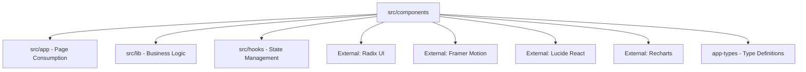

# CLAUDE.md for /src/components/

## Folder Identity
### Classification
- **Primary Type**: Source Code - React Components
- **Secondary Types**: TypeScript, Production-Ready, Modular Design System
- **Domain**: User Interface, Chat System, AI Integration, Workflow Management
- **Criticality**: Essential

### Purpose Statement
This folder contains the complete UI component library for the Better Chatbot platform, serving as the visual and interactive foundation that enables users to communicate with AI models, manage agents, configure MCP tools, and design workflows. It implements a sophisticated design system built on Radix UI primitives with custom styling, animations, and specialized AI-focused components.

## Architectural Context

### Position in Project Hierarchy
```
better-chatbot/
├── src/
│   ├── app/                    # Next.js App Router
│   ├── lib/                    # Business logic
│   ├── hooks/                  # React hooks
│   └── components/ ← YOU ARE HERE
│       ├── agent/              # Agent management UI
│       ├── layouts/            # App-wide layout components
│       ├── tool-invocation/    # Tool result visualization
│       ├── ui/                 # Reusable design system primitives
│       ├── workflow/           # Visual workflow builder components
│       └── [40+ root components] # Feature-specific components
```

### Relationship Map


### Integration Points
- **Upstream Dependencies**:
  - `src/lib/` for business logic, utilities, AI integration
  - `src/hooks/` for React state management
  - `app-types/` for TypeScript definitions
  - External UI libraries (Radix, Framer Motion, Lucide)
- **Downstream Consumers**:
  - `src/app/` Next.js pages and layouts
  - Self-referential (components import other components)
- **Sibling Interactions**: Heavy cross-component communication within folder
- **External Integrations**: Radix UI (accessibility), Framer Motion (animations), Recharts (data visualization)

## Complete Content Inventory

### File Structure (Detailed)
```
src/components/
├── 📁 agent/                           # AI Agent Management UI (6 files)
│   ├── 📄 agent-dropdown.tsx          # Agent selection interface
│   ├── 📄 agent-icon-picker.tsx       # Visual icon selection for agents
│   ├── 📄 agent-tool-selector.tsx     # Tool permission configuration
│   ├── 📄 agents-list.tsx            # Agent gallery and management
│   ├── 📄 edit-agent.tsx             # Agent creation/editing interface
│   └── 📄 generate-agent-dialog.tsx   # AI-powered agent generation
├── 📁 layouts/                        # App Structure Components (8 files)
│   ├── 📄 app-header.tsx             # Main application header
│   ├── 📄 app-popup-provider.tsx     # Global popup/modal state management
│   ├── 📄 app-sidebar.tsx            # Main navigation sidebar
│   ├── 📄 app-sidebar-agents.tsx     # Agent navigation section
│   ├── 📄 app-sidebar-menus.tsx      # Menu items and navigation
│   ├── 📄 app-sidebar-threads.tsx    # Chat thread management
│   ├── 📄 app-sidebar-user.tsx       # User profile and settings
│   └── 📄 theme-provider.tsx         # Dark/light theme context
├── 📁 tool-invocation/               # Tool Result Visualization (10 files)
│   ├── 📄 bar-chart.tsx             # Data visualization - bar charts
│   ├── 📄 code-executor.tsx         # Code execution interface
│   ├── 📄 code.worker.ts            # Web worker for code execution
│   ├── 📄 interactive-table.tsx     # Sortable/filterable data tables
│   ├── 📄 line-chart.tsx           # Data visualization - line charts
│   ├── 📄 pie-chart.tsx            # Data visualization - pie charts
│   ├── 📄 sequential-thinking.tsx    # AI reasoning process display
│   ├── 📄 shared.tool-invocation.ts # Shared utilities for tool results
│   ├── 📄 web-search.tsx           # Web search result display
│   └── 📄 workflow-invocation.tsx   # Workflow execution visualization
├── 📁 ui/                           # Design System Primitives (67 files)
│   ├── 📄 [22 radix-based].tsx     # Core UI primitives (button, dialog, etc.)
│   ├── 📄 [15 provider-icons].tsx  # AI model provider icons (OpenAI, Claude, etc.)
│   ├── 📄 [12 service-icons].tsx   # Third-party service icons (GitHub, Stripe, etc.)
│   ├── 📄 [18 custom-ui].tsx       # Custom components (particles, animations, etc.)
├── 📁 workflow/                     # Visual Workflow Builder (20 files)
│   ├── 📄 workflow.tsx             # Main workflow canvas component
│   ├── 📄 workflow-panel.tsx       # Workflow configuration panel
│   ├── 📄 default-node.tsx         # Base workflow node component
│   ├── 📁 node-config/             # Node configuration components (8 files)
│   │   ├── 📄 llm-node-config.tsx  # LLM model node configuration
│   │   ├── 📄 tool-node-config.tsx # Tool execution node configuration
│   │   └── 📄 [6 other configs].tsx # Input, output, HTTP, condition, template nodes
│   └── 📄 [11 other workflow].tsx  # Node management, variables, UI components
├── 📄 chat-bot.tsx                  # Main chat interface component (15.5k lines)
├── 📄 chat-bot-voice.tsx           # Voice chat functionality (21.2k lines)
├── 📄 message-parts.tsx            # Message rendering and interaction (38.1k lines)
├── 📄 prompt-input.tsx             # Chat input with mentions and tools (14.3k lines)
├── 📄 mcp-*.tsx                    # MCP (Model Context Protocol) components (5 files)
├── 📄 tool-select-dropdown.tsx     # Tool selection interface (34.5k lines)
└── 📄 [25+ feature components].tsx # Specialized UI components for specific features
```

### File Categories and Purposes

#### Core Chat Components (Essential for chat functionality)
- **chat-bot.tsx**: Main chat interface with message streaming, tool execution, state management
- **chat-bot-voice.tsx**: Voice chat integration with real-time audio processing
- **message-parts.tsx**: Complex message rendering with tool results, markdown, editing capabilities
- **prompt-input.tsx**: Advanced input component with mentions, tool selection, keyboard shortcuts
- **message.tsx**: Individual message component with user/assistant differentiation

#### MCP Integration Components (Model Context Protocol)
- **mcp-card.tsx**: Individual MCP server configuration card
- **mcp-dashboard.tsx**: MCP server management interface
- **mcp-editor.tsx**: MCP server configuration editor
- **mcp-customization-popup.tsx**: Tool customization interface
- **mcp-overview.tsx**: MCP system status and overview

#### UI Design System (Radix-based primitives)
- **22 Radix Components**: button, dialog, dropdown-menu, tooltip, etc. - accessibility-first primitives
- **15 AI Provider Icons**: OpenAI, Claude, Gemini, Grok, etc. - branded SVG components
- **12 Service Icons**: GitHub, Stripe, Canva, Linear, etc. - third-party integration icons
- **18 Custom UI Components**: particles, light-rays, text-shimmer, etc. - branded visual effects

#### Agent Management System
- **agents-list.tsx**: Gallery view of available agents
- **edit-agent.tsx**: Agent creation and modification interface
- **agent-dropdown.tsx**: Agent selection in chat interface
- **agent-tool-selector.tsx**: Configure which tools agents can access

#### Workflow Engine UI
- **workflow.tsx**: Visual workflow builder using React Flow (XYFlow)
- **20+ workflow components**: Node types, configuration panels, variable management
- **node-config/*.tsx**: Specialized configuration UI for each workflow node type

#### Layout and Navigation
- **app-sidebar*.tsx**: Modular sidebar components for different sections
- **app-header.tsx**: Main application header with user controls
- **theme-provider.tsx**: Dark/light mode theme management

#### Tool Visualization Components
- **Interactive charts**: bar-chart.tsx, line-chart.tsx, pie-chart.tsx using Recharts
- **code-executor.tsx**: Code execution interface with syntax highlighting
- **web-search.tsx**: Search result display with metadata
- **sequential-thinking.tsx**: AI reasoning process visualization

### File Relationships and Dependencies
```
[Main Chat Flow]
chat-bot.tsx
  ↓ imports & renders
prompt-input.tsx + message-parts.tsx + chat-greeting.tsx
  ↓ uses
ui/* (design system primitives)
  ↓ integrates with
tool-invocation/* (result visualization)

[MCP Integration Flow]
mcp-dashboard.tsx
  ↓ renders
mcp-card.tsx → mcp-editor.tsx → mcp-customization-popup.tsx
  ↓ uses
tool-select-dropdown.tsx

[Agent System Flow]
agents-list.tsx
  ↓ uses
edit-agent.tsx → agent-icon-picker.tsx + agent-tool-selector.tsx
  ↓ renders in
agent-dropdown.tsx

[Layout Hierarchy]
layouts/app-sidebar.tsx
  ↓ composes
app-sidebar-threads.tsx + app-sidebar-agents.tsx + app-sidebar-menus.tsx + app-sidebar-user.tsx
```

## Technology & Patterns

### Technology Stack
- **Languages**: TypeScript 5.x with strict mode
- **UI Framework**: React 18+ with Next.js 15 App Router
- **Styling**: Tailwind CSS with CSS-in-JS for dynamic styles
- **Design System**: Radix UI primitives with custom theming
- **Animations**: Framer Motion for complex animations and transitions
- **Icons**: Lucide React for consistent iconography
- **Charts**: Recharts for data visualization
- **Code Highlighting**: Prism.js integration for syntax highlighting

### Design Patterns Detected
- **Compound Component Pattern**: Complex components like `Dialog` composed of multiple sub-components
- **Render Props Pattern**: Used in chart components and data visualization
- **Context Provider Pattern**: Theme management, popup state, app-wide state
- **Custom Hook Integration**: Heavy use of custom hooks for state and side effects
- **Controlled/Uncontrolled Component Pattern**: Input components with both modes
- **Factory Pattern**: Dynamic component rendering based on tool types and message content

### Coding Standards Applied
- **Naming Conventions**:
  - Components: PascalCase (e.g., `ChatBot`, `PromptInput`)
  - Files: kebab-case (e.g., `chat-bot.tsx`, `prompt-input.tsx`)
  - Props interfaces: `Props` or `ComponentNameProps`
- **File Organization**:
  - Single component per file with co-located types
  - Barrel exports from ui/ directory for easy importing
  - Logical grouping by feature domain (agent/, workflow/, tool-invocation/)
- **Import Patterns**:
  - External dependencies first
  - Internal lib/ imports
  - Relative component imports last
  - Consistent use of path aliases (ui/, lib/, app-types/)

## Operational Workflows

### Development Workflow
1. **Creation**: New components follow existing patterns, use ui/ primitives where possible
2. **Modification**: Components are highly modular, changes typically isolated to single files
3. **Integration**: New features integrate through existing component composition patterns
4. **Testing**: Components tested through Playwright E2E tests and Vitest unit tests

### Build & Deployment
- **Build Process**: Next.js processes all components, tree-shaking unused code
- **Bundle Optimization**: Dynamic imports used for heavy components (workflow editor, charts)
- **Performance**: Large components (message-parts.tsx, tool-select-dropdown.tsx) optimized with React.memo
- **Asset Handling**: SVG icons inlined, animations lazy-loaded

### Component Lifecycle Patterns
- **Stateful Components**: Use Zustand store (appStore) for global state
- **Server/Client Boundary**: Most components are client-side ("use client"), with server components in layouts
- **Error Boundaries**: Error handling through safe() utility from ts-safe library
- **Loading States**: Consistent loading UI patterns across components

## Critical Context & Warnings

### ⚠️ Critical Information
- **Do NOT modify**: Large generated components like ui/chart.tsx without understanding Recharts integration
- **Performance hotspots**:
  - message-parts.tsx (38k lines) - handles all message rendering
  - tool-select-dropdown.tsx (34k lines) - complex tool selection logic
  - chat-bot.tsx - core chat logic, changes affect entire app
- **State management**: Components heavily rely on appStore (Zustand), breaking these connections affects functionality
- **Bundle size impact**: Heavy components use dynamic imports to avoid blocking initial load

### 📌 Important Conventions
- **"use client" directive**: Most components are client-side due to interactivity requirements
- **Import aliases**: Always use `ui/` for design system components, never relative paths
- **Type safety**: All props strictly typed, extensive use of TypeScript generics
- **Accessibility**: Radix UI ensures ARIA compliance, don't bypass with custom implementations
- **Animation patterns**: Use Framer Motion's `motion` components, avoid CSS animations for complex interactions

### 🔄 State Management
- **Global State**: Zustand store (appStore) for chat, tools, models, user preferences
- **Local State**: React useState for component-specific state
- **Server State**: SWR for data fetching and caching
- **Form State**: React Hook Form for complex forms (agent editing, workflow configuration)

## Usage Examples

### Example 1: Creating a New Chat Feature Component
```typescript
"use client";

import { Button } from "ui/button";
import { Dialog, DialogContent, DialogHeader, DialogTitle } from "ui/dialog";
import { appStore } from "@/app/store";
import { useShallow } from "zustand/shallow";

interface Props {
  onFeatureAction: () => void;
}

export function NewChatFeature({ onFeatureAction }: Props) {
  const [model] = appStore(useShallow((state) => [state.chatModel]));

  return (
    <Dialog>
      <DialogContent>
        <DialogHeader>
          <DialogTitle>New Feature</DialogTitle>
        </DialogHeader>
        <Button onClick={onFeatureAction}>
          Use {model} for this action
        </Button>
      </DialogContent>
    </Dialog>
  );
}
```

### Example 2: Integrating with Tool Invocation System
```typescript
// Add to tool-invocation/ directory
"use client";

import { ToolInvocation } from "ai";
import { memo } from "react";
import { Card } from "ui/card";

interface Props {
  toolInvocation: ToolInvocation;
}

export const CustomToolResult = memo(({ toolInvocation }: Props) => {
  const result = JSON.parse(toolInvocation.result);

  return (
    <Card className="p-4">
      <h3>Custom Tool Result</h3>
      <pre>{JSON.stringify(result, null, 2)}</pre>
    </Card>
  );
});

CustomToolResult.displayName = "CustomToolResult";
```

## Evolution & History

### Version History Patterns
- **Change frequency**: High - active development with daily commits
- **Change types**: Feature additions (new AI integrations), UI improvements, performance optimizations
- **Breaking changes**: Rare due to modular architecture, mostly internal API changes
- **Migration patterns**: Gradual migration from older patterns to newer React/Next.js features

### Future Considerations
- **Planned changes**:
  - Further modularization of large components (message-parts.tsx)
  - Migration to React 19 features (use, startTransition improvements)
  - Enhanced accessibility features
- **Scalability**:
  - Component library growing, considering design system documentation
  - Bundle size monitoring as new features added
- **Technical debt**:
  - Some components (tool-select-dropdown.tsx) need refactoring for maintainability
  - Consolidation of similar icon components

## Quick Reference

### Essential Commands
```bash
# Run development server to see component changes
pnpm dev

# Type check components
pnpm check-types

# Test components
pnpm test
pnpm test:e2e

# Build to verify component integration
pnpm build:local
```

### Key Files to Understand First
1. **ui/button.tsx** - Start here to understand design system patterns
2. **chat-bot.tsx** - Core chat functionality and app structure
3. **layouts/app-sidebar.tsx** - App navigation and layout structure
4. **message-parts.tsx** - Complex message rendering logic

### Common Tasks
- **To add a new UI primitive**: Create in `ui/` directory, follow Radix UI patterns
- **To modify chat interface**: Work with `chat-bot.tsx` and related chat-* components
- **To add tool visualization**: Create component in `tool-invocation/` directory
- **To extend agent system**: Modify components in `agent/` directory
- **To enhance workflows**: Work with components in `workflow/` directory

## Domain-Specific Intelligence

### AI/LLM Integration Patterns
- Components designed for streaming responses and real-time tool execution
- Extensive support for different AI model providers (OpenAI, Anthropic, Google, etc.)
- Tool result visualization optimized for AI-generated content
- Message threading and conversation management built into component architecture

### MCP (Model Context Protocol) Integration
- Components specifically designed for MCP server management
- Dynamic tool loading and configuration UI
- Real-time tool availability and status indication
- Tool permission and access control interfaces

### Workflow Engine Integration
- Visual workflow builder components using React Flow
- Node-based programming interface for AI workflows
- Dynamic form generation for different node types
- Variable scoping and data flow visualization

### Accessibility Standards
- Full WCAG compliance through Radix UI foundation
- Keyboard navigation support across all interactive components
- Screen reader optimized with proper ARIA labels
- High contrast theme support built into design system

### Performance Considerations
- Large components use React.memo and useMemo for optimization
- Dynamic imports for heavy features (charts, workflow editor)
- Virtual scrolling in large lists (thread list, agent gallery)
- Debounced inputs for search and real-time features

## Cross-Reference Index

### Related Documentation
- **Main Project CLAUDE.md**: `/better-chatbot/CLAUDE.md` - Overall project context
- **API Documentation**: `/src/app/api/` - Backend integration patterns
- **Type Definitions**: `/app-types/` - Shared TypeScript interfaces
- **Business Logic**: `/src/lib/` - Core functionality these components consume

### Similar Folders
- **`/src/app/`**: Consumes these components in Next.js pages
- **`/src/hooks/`**: Custom hooks used extensively by these components
- **`/tests/`**: E2E tests that verify component behavior

### External Dependencies Reference
- **Radix UI**: https://radix-ui.com - Core accessibility primitives
- **Framer Motion**: https://framer.com/motion - Animation library
- **Recharts**: https://recharts.org - Data visualization components
- **Lucide React**: https://lucide.dev - Icon system

---
*Generated for /src/components/ on 2025-09-15*
*Analysis Depth: comprehensive*
*This CLAUDE.md provides comprehensive context for AI assistance with the Better Chatbot component system*